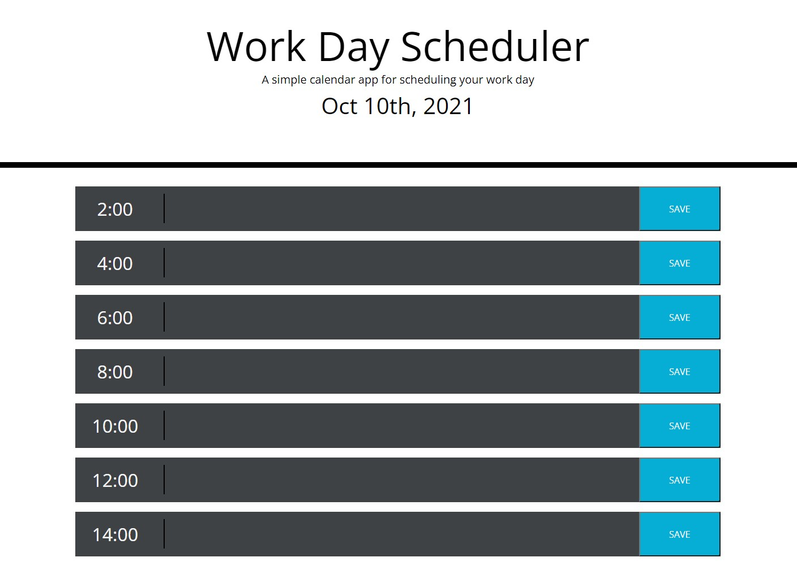

# Work Day Scheduler

A simple Work Day Scheduler that displayes current time dynamically and allowes the user to set personal notes or schedule things on time blocks.

## Built With

* [HTML](https://developer.mozilla.org/en-US/docs/Web/HTML)
* [CSS](https://developer.mozilla.org/en-US/docs/Web/CSS)
* [Javascript](https://developer.mozilla.org/en-US/docs/Web/JavaScript)
* [Moment.js](https://momentjs.com/)
* [Font Awesome . com](https://fontawesome.com/)
* [Google Fonts](https://developers.google.com/fonts)
* [Bootstrap](https://getbootstrap.com/)

## Deployed Link

* [See Live Site](https://divinemayura.github.io/work-day-scheduler/)

## Authors

* **May Faucher** 

- [Link to Portfolio Site](https://divinemayura.github.io/)
- [Link to Github](https://github.com/DivineMayura)
- [Link to LinkedIn](www.linkedin.com/in/mayfaucher)

## License

This project is licensed under the MIT License 

